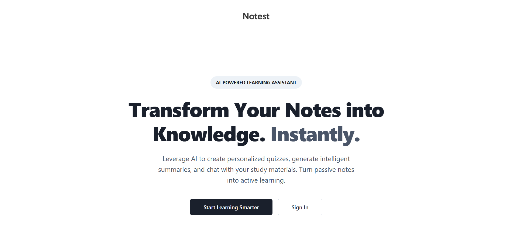
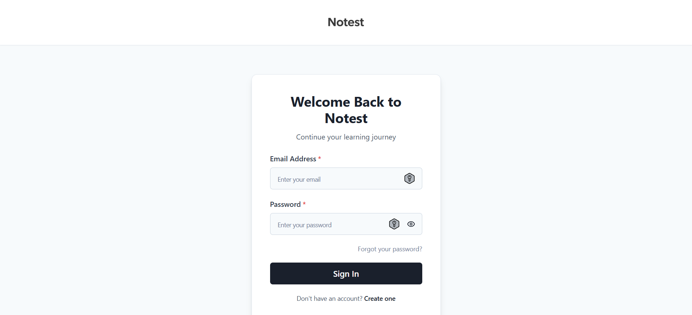
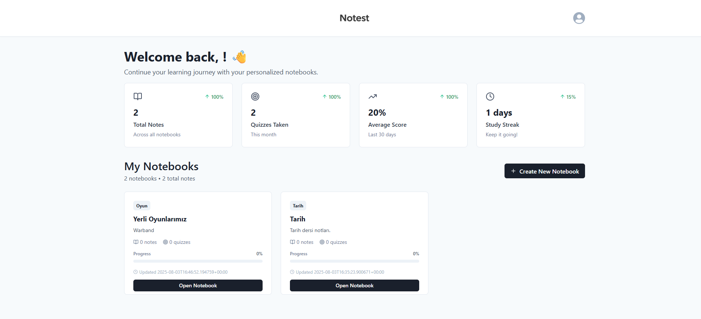
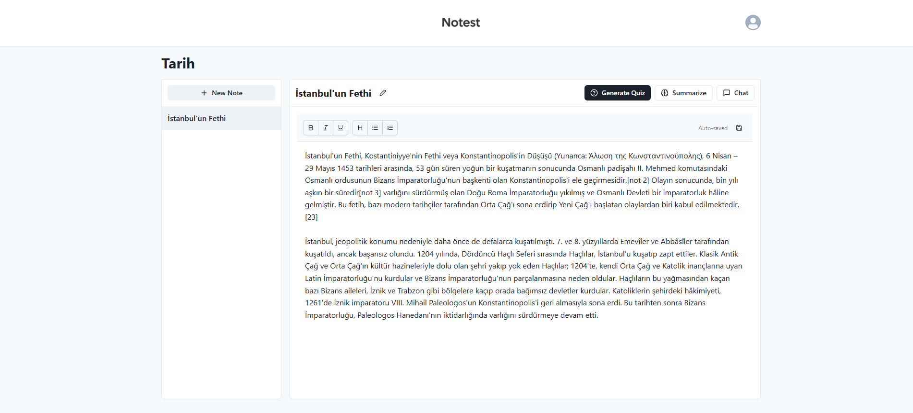
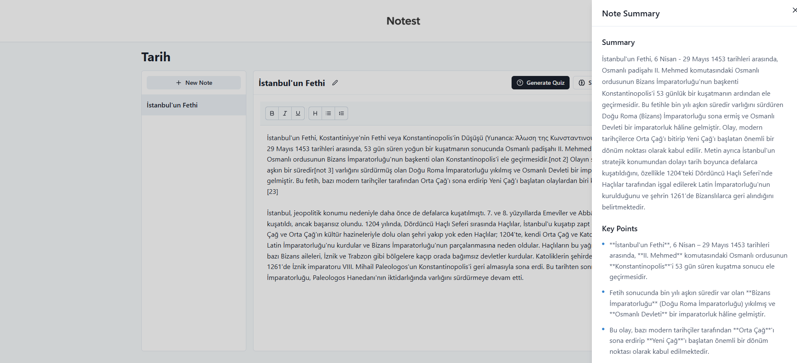
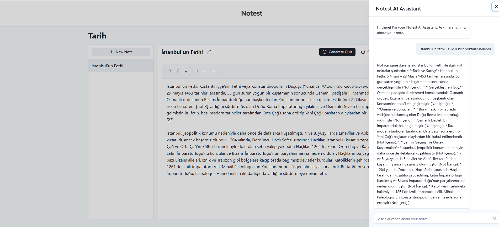
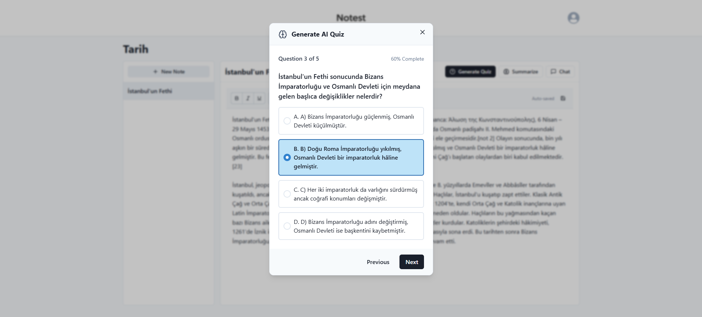
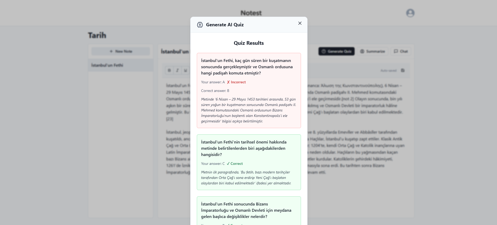
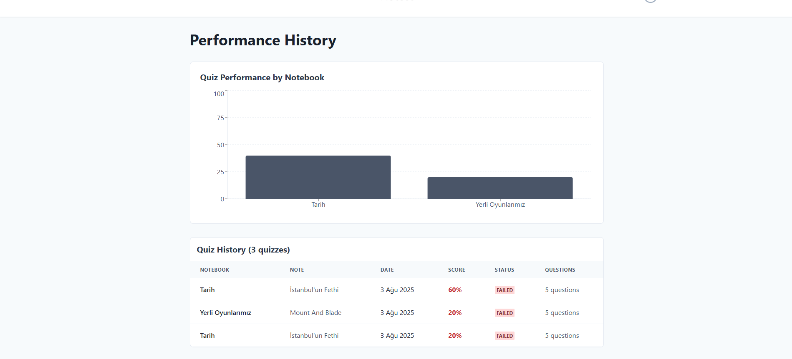
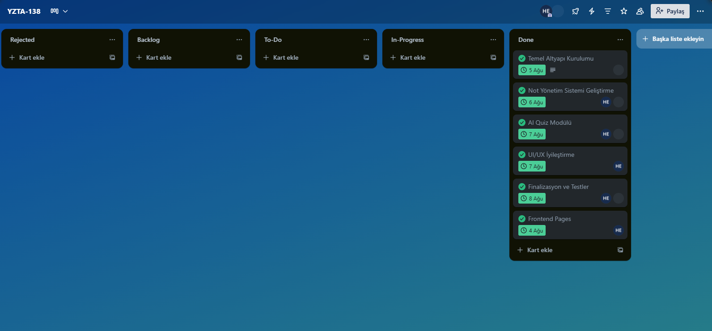

<div align="center">
  
</div>

# 📚 Notest - Gemini Not ve Quiz Asistanı

## 👥 Takım Bilgileri
**Takım Adı:** AI-DATA-138
- 👨‍💼 **Hüseyin Enes ERTÜRK:** Scrum Master / Developer
- 👩‍💻 **Artun ŞEKER:** Developer

---

## 🎯 Proje Açıklaması

**Notest**, öğrencilerin ve yaşam boyu öğrenenlerin dijital notlarını Google Gemini AI ile interaktif bir öğrenme aracına dönüştüren web tabanlı bir uygulamadır. Kullanıcılar notları üzerinden kişiselleştirilmiş quizler oluşturabilir, performanslarını takip edebilir ve yapay zeka destekli özetler ile sohbet özelliklerinden yararlanabilir.

### 🚀 Temel Özellikler
- 📝 **Not Yönetim Sistemi:** Zengin metin editörü ile not alma ve düzenleme
- 🧠 **AI Quiz Modülü:** Gemini API ile otomatik quiz üretimi
- 📊 **Performans Takibi:** Detaylı istatistikler ve ilerleme grafikleri
- 🤖 **Akıllı Asistan:** Not özetleme ve AI sohbet desteği

### 🎯 Hedef Kitle
- 🎓 **Lise ve Üniversite Öğrencileri**
- 📚 **Yaşam Boyu Öğrenenler ve Profesyoneller**
- 👨‍🏫 **Eğitmenler ve Öğretmenler**

### 🛠️ Teknoloji Yığını
- **Frontend:** React.js + Tailwind CSS
- **Backend:** Firebase (Authentication, Firestore, Cloud Functions)
- **AI:** Google Gemini API
- **Deployment:** [Platform]

---

## 📋 Product Backlog

### 🔥 Öncelik Sırası
| **Özellik** | **Açıklama** | **Puan** | **Sprint** |
|-------------|--------------|----------|------------|
| 🏠 **Temel Altyapı** | Supabase kurulumu, auth sistemi | `6` | Sprint 3 |
| 📝 **Not Yönetimi** | Not oluşturma, düzenleme, kaydetme | `8` | Sprint 3 |
| 🧠 **Quiz Sistemi** | Gemini API entegrasyonu, quiz oluşturma | `6` | Sprint 3 |
| 📊 **Sonuç Sistemi** | Quiz sonuçları, performans takibi | `4` | Sprint 3 |
| 🤖 **AI Asistan** | Özetleme ve sohbet özellikleri | `6` | Sprint 3 |
| 🎨 **UI/UX İyileştirme** | Tasarım optimizasyonu | `4` | Sprint 3 |

**Toplam Backlog Puanı:** `34` Puan

---

## 🏃‍♂️ Sprint Detayları

<details>
<summary><h3>🏃‍♂️ Sprint 3 - Performans Takibi, AI Asistan, Temel Altyapı ve Not Yönetimi, UI/UX İyileştirme, Finalizasyon, Quiz Sistemi ve Gemini Entegrasyonu</h3></summary>

### 🎯 Sprint Hedefi
**Frontend tasarımı tamamlanacak. AI entegrasyonu ve authentication kurulumları tamamlanacak. Temel not tutma işlevi eklenecek.**

### 📊 Sprint Bilgileri
- **📅 Sprint Süresi:** 21.07.2025 - 03.08.2025
- **🎯 Hedef Puan:** `34` Puan
- **✅ Tamamlanan Puan:** `___` Puan
- **📈 Tamamlanma Oranı:** `___%`

### 📋 Sprint Backlog

#### 🔥 Yüksek Öncelik
- [ ] **[Görev 1]** - `_` Puan
  - **📝 Açıklama:** 
  - **🎯 Kabul Kriterleri:**
  - **👤 Sorumlu:**

- [ ] **[Görev 2]** - `_` Puan
  - **📝 Açıklama:** 
  - **🎯 Kabul Kriterleri:**
  - **👤 Sorumlu:**

#### ⚡ Orta Öncelik
- [ ] **[Görev 3]** - `_` Puan
  - **📝 Açıklama:** 
  - **🎯 Kabul Kriterleri:**
  - **👤 Sorumlu:**

### 📱 Daily Scrum
**🗣️ Daily Scrum toplantıları:** [Platform/Zaman]

📎 **Daily Scrum Notları:** [Dosya linki]

### 🔍 Sprint Review

#### ✅ Tamamlanan İşler
- **[Tamamlanan özellik/görev]**
- **[Tamamlanan özellik/görev]**

#### ❌ Tamamlanamayan İşler
- **[Tamamlanamayan görev]** - **Sebep:** [Açıklama]

#### 🎯 Demo
**📹 Demo Linki:** [Link]
**📸 Ekran Görüntüleri:**

<div align="center">
  
  
  
</div>

<div align="center">
  
  
  
</div>

<div align="center">
  
  
  
</div>

#### 👥 Sprint Review Katılımcıları
- **[İsim 1]**
- **[İsim 2]**

### 🔄 Sprint Retrospective

#### ✅ İyi Giden Şeyler
- **[Pozitif geri bildirim]**
- **[Pozitif geri bildirim]**

#### ❌ İyileştirilebilir Alanlar
- **[İyileştirme önerisi]**
- **[İyileştirme önerisi]**

#### 🎯 Aksiyonlar (Sonraki Sprint için)
- **[Aksiyon öğesi]**
- **[Aksiyon öğesi]**

</details>

---

## 📈 Proje Özeti

### 🎯 Genel Başarı Metrikleri
- **📊 Toplam Tamamlanan Puan:** `___/___` (`___%`)
- **⏱️ Toplam Süre:** `_` Hafta
- **👥 Aktif Takım Üyesi Sayısı:** `_`
- **🔥 En Başarılı Sprint:** Sprint `_`

### 📚 Öğrenilenler
- **[Teknik öğrenme]**
- **[Süreç öğrenmesi]**
- **[Takım çalışması deneyimi]**

### 🚀 Gelecek Planları
- **[V2.0 özellikleri]**
- **[İyileştirme alanları]**
- **[Yeni teknoloji entegrasyonları]**

---

## 📎 Ek Dökümanlar

### 🔗 Önemli Linkler
- **🌐 Canlı Demo:** [Link]
- **📋 Miro/Trello Board:**

<div align="center">
  
</div>
- **📹 Tanıtım Videosu:** [YouTube - Notest Tanıtım Videosu](https://www.youtube.com/watch?v=P3YZLxeOlL0)

### 📁 Dosya Yapısı
```
📁 ProjectManagement/
├── 📁 Sprint1Documents/
│   ├── 📄 DailyScrumMeetingNotesSprint1.md
│   ├── 📄 SprintReviewSprint1.md
│   └── 📸 Screenshots/
├── 📁 Sprint2Documents/
│   ├── 📄 DailyScrumMeetingNotesSprint2.md
│   ├── 📄 SprintReviewSprint2.md
│   └── 📸 Screenshots/
├── 📁 Sprint3Documents/
│   ├── 📄 DailyScrumMeetingNotesSprint3.md
│   ├── 📄 SprintReviewSprint3.md
│   └── 📸 Screenshots/
└── 📁 Sprint4Documents/
    ├── 📄 DailyScrumMeetingNotesSprint4.md
    ├── 📄 SprintReviewSprint4.md
    └── 📸 Screenshots/
```

---

## 📞 İletişim

**🏢 Takım:** AI-DATA-138  
**📧 E-posta:** huseyineneserturk@gmail.com
**📅 Son Güncelleme:** 03.08.2025

---

**🎯 "Öğrenmeyi kişiselleştiren, bilgiyi sorgulanabilir kılan akıllı eğitim asistanı"**

**💡 Notest ile notlarınız artık sadece bilgi deposu değil, interaktif öğrenme arkadaşınız!**
